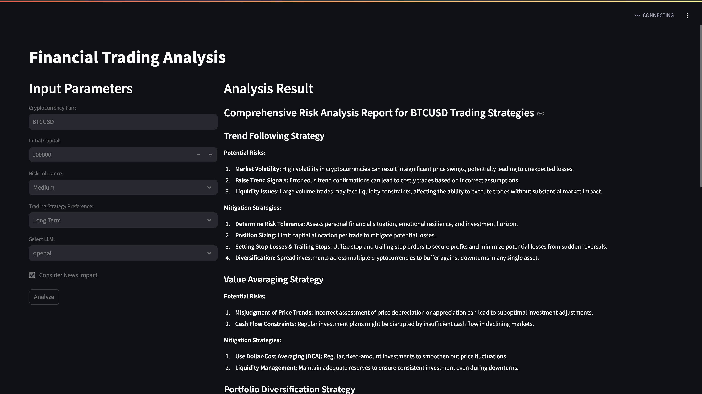

# CrewAI Financial Trading Analysis


This project demonstrates the use of CrewAI for collaborative financial analysis using multiple AI agents. It focuses on analyzing and developing trading strategies for cryptocurrency pairs, with a particular emphasis on BTCUSDT.

## Project Overview

The system consists of two main components:
1. A Jupyter Notebook that showcases the CrewAI implementation
2. A Flask web application that provides a user interface for interacting with the CrewAI system

### Streamlit APP
<a target="_blank">
    
</a>

## System Architecture

The project is structured as follows:

1. Jupyter Notebook (`collaboration_financial_analysis.ipynb`): Demonstrates the CrewAI implementation and serves as a prototype for the system.

2. Flask Application:
   - `app/main.py`: Entry point for the Flask application
   - `app/agents.py`: Defines the AI agents used in the system
   - `app/tasks.py`: Specifies the tasks assigned to each agent
   - `app/crew.py`: Creates and manages the CrewAI setup
   - `app/utils.py`: Contains utility functions for environment setup
   - `templates/`: HTML templates for the web interface
   - `static/`: CSS and other static files for the web interface

3. Streamlit Application:
    - `app.py`: Entry point for the Streamlit application

## Approach

The system uses CrewAI to orchestrate a team of AI agents, each with specific roles in the financial analysis process:

1. Data Analyst: Monitors and analyzes market data for the selected cryptocurrency.
2. Trading Strategy Developer: Develops and refines trading strategies based on insights from the Data Analyst.
3. Trade Advisor: Suggests optimal trade execution strategies.
4. Risk Advisor: Evaluates and provides insights on the risks associated with potential trading activities.

These agents collaborate to provide a comprehensive analysis of the selected cryptocurrency pair, considering factors such as market trends, trading strategies, execution plans, and risk assessment.

The Flask web application allows users to input their trading parameters, including:
- Cryptocurrency pair selection
- Initial capital
- Risk tolerance
- Trading strategy preference
- News impact consideration

The CrewAI system then processes these inputs and generates a detailed analysis report, which is presented to the user through the web interface.

## Key Features

- Multi-agent collaboration for in-depth financial analysis
- Integration of CrewAI with a web-based user interface
- Customizable trading parameters for personalized analysis
- Comprehensive risk assessment and strategy development

## Getting Started

To run this project locally:

1. Clone the repository
2. Install the required dependencies:
   ```
   pip install -r requirements.txt
   ```
3. Set up your environment variables in a `.env` file:
   ```
   OPENAI_API_KEY=your_openai_api_key
   SERPER_API_KEY=your_serper_api_key
   ```
4. Run the Flask application:
   ```
   python -m app.main
   ```
OR

4. Run the Streamlit application:
   ```
   streamlit run app.py
   ```


For a detailed demonstration of the CrewAI implementation, refer to the `collaboration_financial_analysis.ipynb` notebook.

## Conclusion

This project showcases the power of AI-driven collaborative financial analysis, combining the strengths of multiple specialized agents to provide comprehensive insights for cryptocurrency trading. The integration with a web interface makes it accessible and user-friendly, allowing for easy customization of trading parameters and strategy analysis.

### Notebook Output
<a target="_blank">
    
</a>